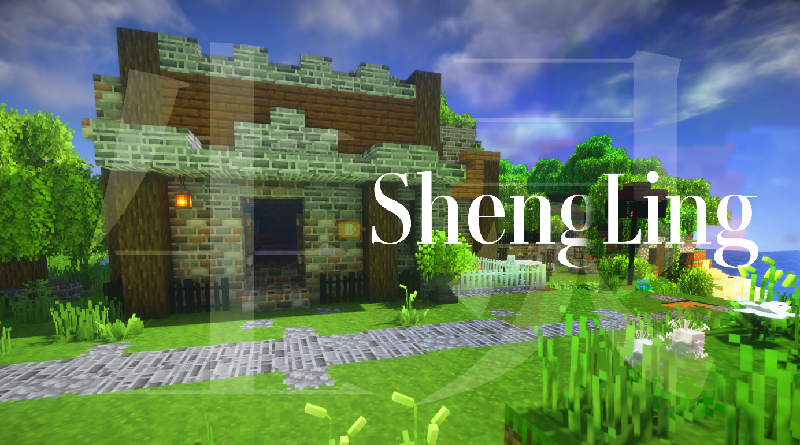
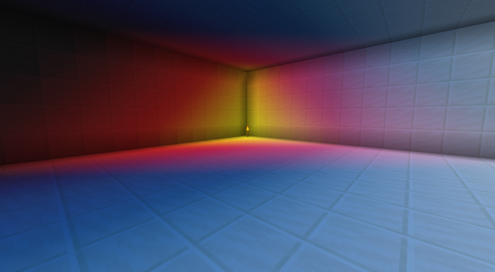

Welcome to the detail of ShengLing resources pack

## **Lighting Effect**

The vanilla lightmap is modified. The light is more pleasing and closes to the real-life lights.

Also modified the nether and the end's.

Now your world have fireflies and they can glow at nights.

Ores can glow in the cave as well.

They will have a better looks if you have a nice shader.

## Cavern & Surface Environment

I call it the **Stratum**, which make stone blocks look differently at different heights.

It also can be affected depending on biomes.

The savanna biomes are now become **Lavender field**.

Dirt is mud in the jungle and frozen dirt in the snow biomes.

## Plants

Crops and flowers are in 3D now. And added more than 40 types of flowers.

Many fruits like apples grow in the trees.

## Creatures & relics

All those stuffs are natural generates.

.png)

## Deep sea

The ocean is now more colourful, lively, not as the vanilla looks.

There're creates and drifting bottle on the surface of the sea.

## Furniture

To check the manual link in the PMC page for more information about the furniture.

Hope you enjoy my works! 

