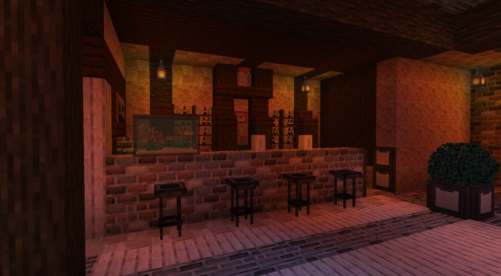
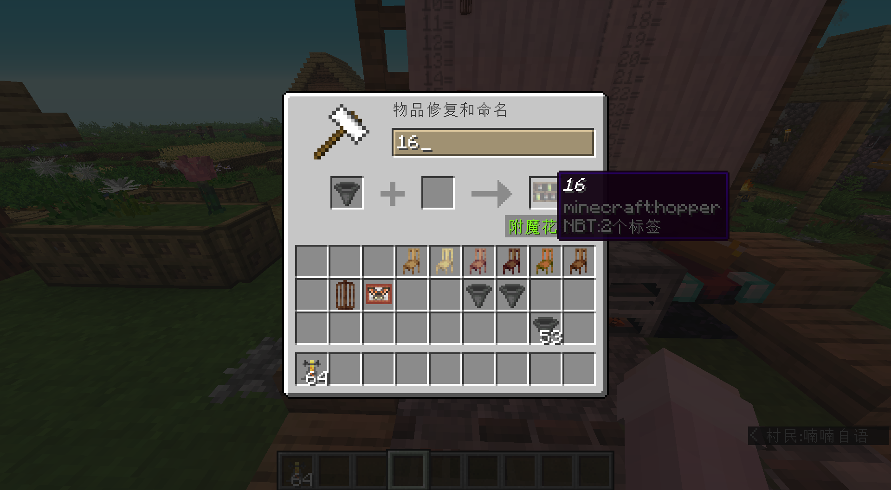
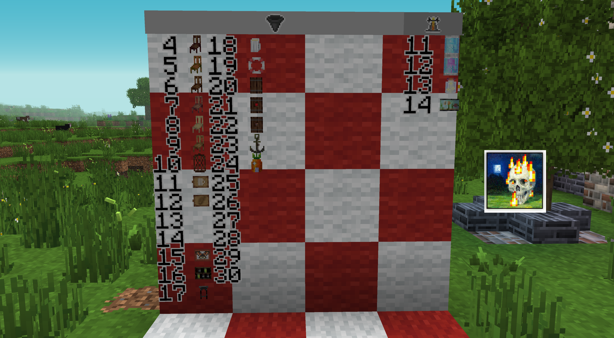
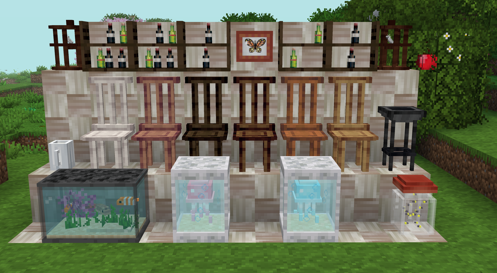
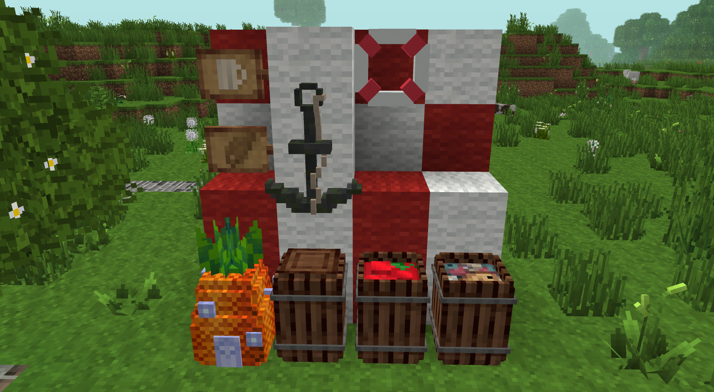

# Welcome to the ShengLing Furniture manual

​	Welcome to the ShengLing Custom Furniture manual. In this document  will guide you to make the furniture in the vanilla game with Shengling resources pack. Apologize my bad expression. Hope you can understand.

​	To make the furniture like the image above, you should prepare an anvil and some exp. By renaming the anvils or brewing  stands 

## Names:

### [Hopper]:

​	

|       4        |       5       |                   6                    |         7          |
| :------------: | :-----------: | :------------------------------------: | :----------------: |
| dark oak chair | acacia chair  |              spruce chair              |    jungle chair    |
|       8        |       9       |                   10                   |         15         |
|  birch chair   |   oak chair   |               bird cage                | butterfly specimen |
|       16       |      17       |                   18                   |         11         |
|  wine's shelf  | chair for bar |                beer cup                |      bar sign      |
|       12       |      19       |                   20                   |         21         |
|   fish sign    |     buoy      |                 barrel                 |   apples barrel    |
|       22       |      23       |                   24                   |                    |
|  fish barrel   |    anchor     | spongebob squarepants' pineapple house |                    |

### [Brewing Stand]: 

|           11            |              12              |           13            |    14     |
| :---------------------: | :--------------------------: | :---------------------: | :-------: |
| jellyfish in the bottle | pink jellyfish in the bottle | fireflies in the bottle | fish tank |
|                         |                              |                         |           |
|                         |                              |                         |           |

​	Or you can by another  way to check the names in game. Put a painting like this. 4x4. This manual replaces the painting on the right side.

Added in 1.23:

Added in 1.32:

